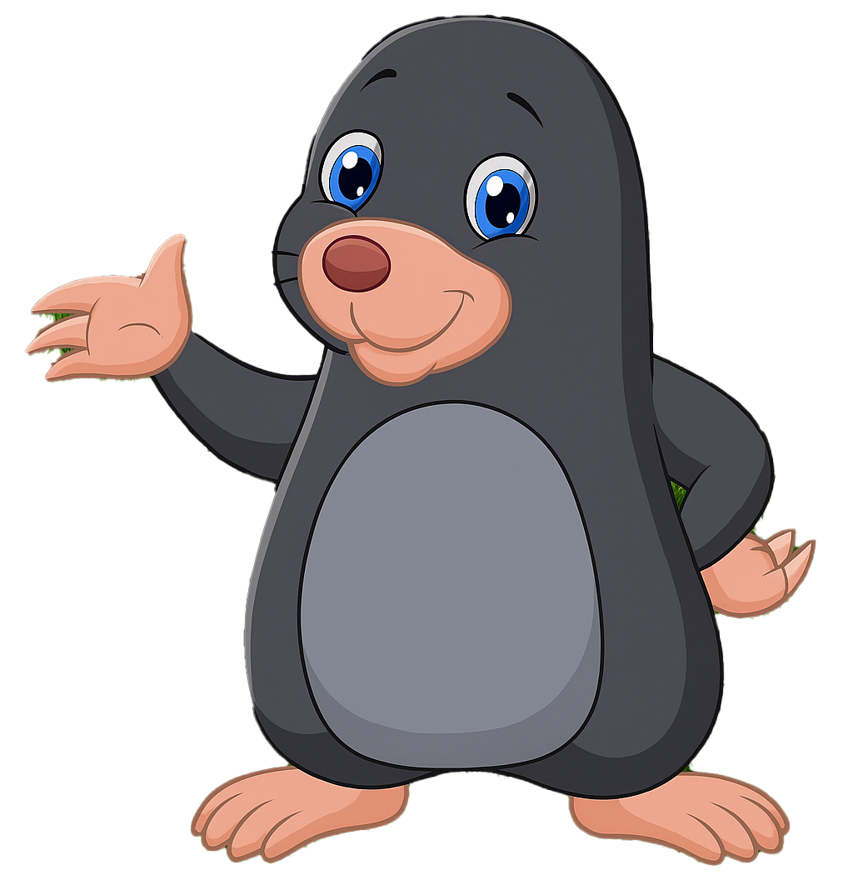

# TP-JuegoTopos

Un divertido juego de topo desarrollado con HTML, CSS y JavaScript, donde el objetivo es [breve descripción de la dinámica del juego].



## Contenido
- [Tecnologías](#tecnologías)
- [Instalación](#instalación)
- [Créditos](#créditos)

## Tecnologías
- HTML
- CSS
- JavaScript

## Instalación
```bash
git clone https://github.com/aletorresprado/TP-JuegoTopos.git
# Luego abre `index.html` en tu navegador favorito

## Créditos
- Trabajo Practico realizado en clases [Rolling School].
- https://web.rollingcodeschool.com
